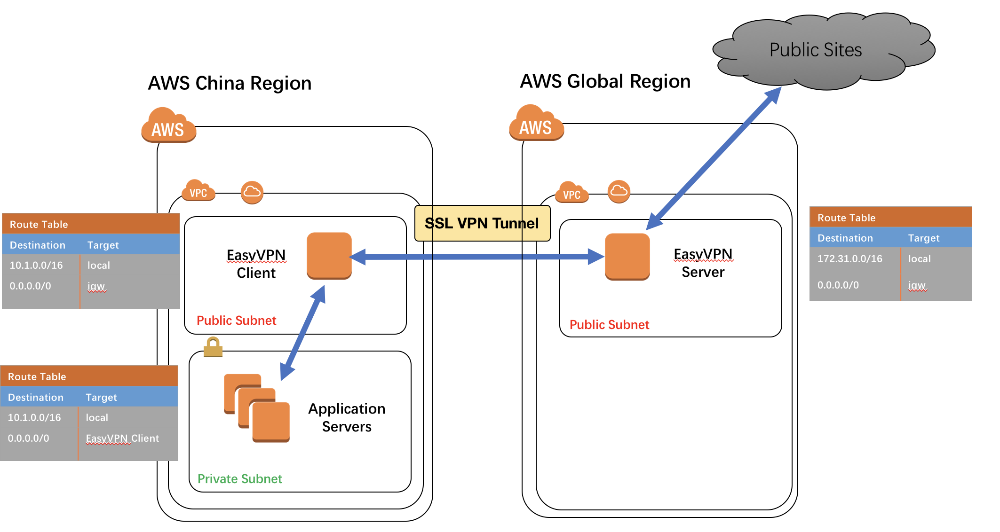

# EasyVPN
Fast ways to setup VPN connections ( Do not use it in a commercial way )



## Objectives
  - [X] 1. [CloudFormation template](README.md#1-cloudformation-template) - Json format : 2018/04/28
  - [X] 2. [CloudFormation template](README.md#1-cloudformation-template) - YAML format : 2018/04/30
  - [X] 3. CloudFormation template - WebConsole support : 2018/04/28
  - [X] 4. [CloudFormation template - CLI support](README.md#4-cloudformation-template---cli-support) : 2018/05/01
  - [ ] 5. CloudFormation template - Python3 support
  - [ ] 6. Terraform format support
  - [ ] 7. Docker support
  
## Manual
### 1. CloudFormation template
 - EasyVPN Server Setup
    - Support regions(Tested with * ): Virginia, Tokyo, Seoul, Ohio
    - Server Template: 
    
	AWS Region   | JSON Format  | YAML Format 
	------------ | ------------ | ------------
	Virginia* | [](https://console.aws.amazon.com/cloudformation/home?region=us-east-1#/stacks/new?stackName=EasyVPNServer&amp;templateURL=https://s3-ap-southeast-1.amazonaws.com/leopublic/templates/EasyVPN/EasyVPN_Server.template) | [](https://console.aws.amazon.com/cloudformation/home?region=us-east-1#/stacks/new?stackName=EasyVPNServer&amp;templateURL=https://s3-ap-southeast-1.amazonaws.com/leopublic/templates/EasyVPN/EasyVPN_Server.yaml)
	Ohio* | [](https://console.aws.amazon.com/cloudformation/home?region=us-east-2#/stacks/new?stackName=EasyVPNServer&amp;templateURL=https://s3-ap-southeast-1.amazonaws.com/leopublic/templates/EasyVPN/EasyVPN_Server.template) | [](https://console.aws.amazon.com/cloudformation/home?region=us-east-2#/stacks/new?stackName=EasyVPNServer&amp;templateURL=https://s3-ap-southeast-1.amazonaws.com/leopublic/templates/EasyVPN/EasyVPN_Server.yaml)
	Califonia | [](https://console.aws.amazon.com/cloudformation/home?region=us-west-1#/stacks/new?stackName=EasyVPNServer&amp;templateURL=https://s3-ap-southeast-1.amazonaws.com/leopublic/templates/EasyVPN/EasyVPN_Server.template) | [](https://console.aws.amazon.com/cloudformation/home?region=us-west-1#/stacks/new?stackName=EasyVPNServer&amp;templateURL=https://s3-ap-southeast-1.amazonaws.com/leopublic/templates/EasyVPN/EasyVPN_Server.yaml)
	Oregon | [](https://console.aws.amazon.com/cloudformation/home?region=us-west-2#/stacks/new?stackName=EasyVPNServer&amp;templateURL=https://s3-ap-southeast-1.amazonaws.com/leopublic/templates/EasyVPN/EasyVPN_Server.template) | [](https://console.aws.amazon.com/cloudformation/home?region=us-west-2#/stacks/new?stackName=EasyVPNServer&amp;templateURL=https://s3-ap-southeast-1.amazonaws.com/leopublic/templates/EasyVPN/EasyVPN_Server.yaml)
	Canada | [](https://console.aws.amazon.com/cloudformation/home?region=ca-central-1#/stacks/new?stackName=EasyVPNServer&amp;templateURL=https://s3-ap-southeast-1.amazonaws.com/leopublic/templates/EasyVPN/EasyVPN_Server.template) | [](https://console.aws.amazon.com/cloudformation/home?region=ca-central-1#/stacks/new?stackName=EasyVPNServer&amp;templateURL=https://s3-ap-southeast-1.amazonaws.com/leopublic/templates/EasyVPN/EasyVPN_Server.yaml)
	Ireland | [](https://console.aws.amazon.com/cloudformation/home?region=eu-west-1#/stacks/new?stackName=EasyVPNServer&amp;templateURL=https://s3-ap-southeast-1.amazonaws.com/leopublic/templates/EasyVPN/EasyVPN_Server.template) | [](https://console.aws.amazon.com/cloudformation/home?region=eu-west-1#/stacks/new?stackName=EasyVPNServer&amp;templateURL=https://s3-ap-southeast-1.amazonaws.com/leopublic/templates/EasyVPN/EasyVPN_Server.yaml)
	London | [](https://console.aws.amazon.com/cloudformation/home?region=eu-west-2#/stacks/new?stackName=EasyVPNServer&amp;templateURL=https://s3-ap-southeast-1.amazonaws.com/leopublic/templates/EasyVPN/EasyVPN_Server.template) | [](https://console.aws.amazon.com/cloudformation/home?region=eu-west-2#/stacks/new?stackName=EasyVPNServer&amp;templateURL=https://s3-ap-southeast-1.amazonaws.com/leopublic/templates/EasyVPN/EasyVPN_Server.yaml)
	Paris | [](https://console.aws.amazon.com/cloudformation/home?region=eu-west-3#/stacks/new?stackName=EasyVPNServer&amp;templateURL=https://s3-ap-southeast-1.amazonaws.com/leopublic/templates/EasyVPN/EasyVPN_Server.template) | [](https://console.aws.amazon.com/cloudformation/home?region=eu-west-3#/stacks/new?stackName=EasyVPNServer&amp;templateURL=https://s3-ap-southeast-1.amazonaws.com/leopublic/templates/EasyVPN/EasyVPN_Server.yaml)
	Frankfurt | [](https://console.aws.amazon.com/cloudformation/home?region=eu-central-1#/stacks/new?stackName=EasyVPNServer&amp;templateURL=https://s3-ap-southeast-1.amazonaws.com/leopublic/templates/EasyVPN/EasyVPN_Server.template) | [](https://console.aws.amazon.com/cloudformation/home?region=eu-central-1#/stacks/new?stackName=EasyVPNServer&amp;templateURL=https://s3-ap-southeast-1.amazonaws.com/leopublic/templates/EasyVPN/EasyVPN_Server.yaml)
	Mumbai | [](https://console.aws.amazon.com/cloudformation/home?region=ap-south-1#/stacks/new?stackName=EasyVPNServer&amp;templateURL=https://s3-ap-southeast-1.amazonaws.com/leopublic/templates/EasyVPN/EasyVPN_Server.template) | [](https://console.aws.amazon.com/cloudformation/home?region=ap-south-1#/stacks/new?stackName=EasyVPNServer&amp;templateURL=https://s3-ap-southeast-1.amazonaws.com/leopublic/templates/EasyVPN/EasyVPN_Server.yaml)
	Singapore | [](https://console.aws.amazon.com/cloudformation/home?region=ap-southeast-1#/stacks/new?stackName=EasyVPNServer&amp;templateURL=https://s3-ap-southeast-1.amazonaws.com/leopublic/templates/EasyVPN/EasyVPN_Server.template) | [](https://console.aws.amazon.com/cloudformation/home?region=ap-southeast-1#/stacks/new?stackName=EasyVPNServer&amp;templateURL=https://s3-ap-southeast-1.amazonaws.com/leopublic/templates/EasyVPN/EasyVPN_Server.yaml)
	Sydney | [](https://console.aws.amazon.com/cloudformation/home?region=ap-southeast-2#/stacks/new?stackName=EasyVPNServer&amp;templateURL=https://s3-ap-southeast-1.amazonaws.com/leopublic/templates/EasyVPN/EasyVPN_Server.template) | [](https://console.aws.amazon.com/cloudformation/home?region=ap-southeast-2#/stacks/new?stackName=EasyVPNServer&amp;templateURL=https://s3-ap-southeast-1.amazonaws.com/leopublic/templates/EasyVPN/EasyVPN_Server.yaml)
	Tokyo* | [](https://console.aws.amazon.com/cloudformation/home?region=ap-northeast-1#/stacks/new?stackName=EasyVPNServer&amp;templateURL=https://s3-ap-southeast-1.amazonaws.com/leopublic/templates/EasyVPN/EasyVPN_Server.template) | [](https://console.aws.amazon.com/cloudformation/home?region=ap-northeast-1#/stacks/new?stackName=EasyVPNServer&amp;templateURL=https://s3-ap-southeast-1.amazonaws.com/leopublic/templates/EasyVPN/EasyVPN_Server.yaml)
	Seoul* | [](https://console.aws.amazon.com/cloudformation/home?region=ap-northeast-2#/stacks/new?stackName=EasyVPNServer&amp;templateURL=https://s3-ap-southeast-1.amazonaws.com/leopublic/templates/EasyVPN/EasyVPN_Server.template) | [](https://console.aws.amazon.com/cloudformation/home?region=ap-northeast-2#/stacks/new?stackName=EasyVPNServer&amp;templateURL=https://s3-ap-southeast-1.amazonaws.com/leopublic/templates/EasyVPN/EasyVPN_Server.yaml) 
	San Paulo | [](https://console.aws.amazon.com/cloudformation/home?region=sa-east-1#/stacks/new?stackName=EasyVPNServer&amp;templateURL=https://s3-ap-southeast-1.amazonaws.com/leopublic/templates/EasyVPN/EasyVPN_Server.template) | [](https://console.aws.amazon.com/cloudformation/home?region=sa-east-1#/stacks/new?stackName=EasyVPNServer&amp;templateURL=https://s3-ap-southeast-1.amazonaws.com/leopublic/templates/EasyVPN/EasyVPN_Server.yaml)
	China Ningxia | Depending on Lambda | Depending on Lambda
	China Beijing | TODO | TODO
	- Select public subnet
    - Get VPNServerIP, PSK from the output after completed launch
 - EasyVPN Client Setup
    - Support regions: Beijing, Ningxia
    - Client Template: 
	
	AWS Region   | JSON Format  | YAML Format 
	------------ | ------------ | ------------
	China Ningxia* | [](https://console.amazonaws.cn/cloudformation/home?region=cn-northwest-1#/stacks/new?stackName=EasyVPNClient&amp;templateURL=https://s3.cn-north-1.amazonaws.com.cn/leopublic/templates/EasyVPN/EasyVPN_Client.template) | [](https://console.amazonaws.cn/cloudformation/home?region=cn-northwest-1#/stacks/new?stackName=EasyVPNClient&amp;templateURL=https://s3.cn-north-1.amazonaws.com.cn/leopublic/templates/EasyVPN/EasyVPN_Client.yaml)
	China Beijing* | [](https://console.amazonaws.cn/cloudformation/home?region=cn-north-1#/stacks/new?stackName=EasyVPNClient&amp;templateURL=https://s3.cn-north-1.amazonaws.com.cn/leopublic/templates/EasyVPN/EasyVPN_Client.template) | [](https://console.amazonaws.cn/cloudformation/home?region=cn-north-1#/stacks/new?stackName=EasyVPNClient&amp;templateURL=https://s3.cn-north-1.amazonaws.com.cn/leopublic/templates/EasyVPN/EasyVPN_Client.yaml)
    - Select public subnet
 - Modify related routing tables in the Client VPC
 - (Option) Modify client dns server to 8.8.8.8 to better resolve global domain names.
   ``` Bash
   #cat /etc/resolve.conf
   nameserver 8.8.8.8
   ...
   ```
 - Test from the Client subnets

### 4. CloudFormation template - CLI support
- Reference script: cli_samples.sh
  Steps: 
	- Run cli_samples.sh validate_templates part to validate your template format
    - Run cli_samples.sh server_setup part and get output information about VPNServerIP and PSk
    - Run cli_samples.sh client_setup part by using the needed information from previous step and setup the client environment
- validate_templates
```Bash
validate_templates () {
    echo "Templates validation"
    for F in ${CHECK_FILES}; do
        echo "Check $F ......"
        aws cloudformation validate-template --template-body file://$F
        if [ $? -ne 0 ]; then
            echo "$F: Invalid format. Quit"
            exit 0
        fi
    done
}

CHECK_FILES="EasyVPN_Server.template EasyVPN_Client.template EasyVPN_Server.yaml EasyVPN_Client.yaml"
validate_templates
```
- server_setup
```Bash
server_setup() {
    ## Setup EasyVPN Server in Seoul(Korea)
    aws --profile $PROFILE --region $REGION cloudformation create-stack  \
        --stack-name EasyVPNServer \
        --template-body file://EasyVPN_Server.yaml \
        --capabilities CAPABILITY_IAM  \
        --parameters \
            ParameterKey=InstanceType,ParameterValue=t2.micro \
            ParameterKey=KeyName,ParameterValue=[Your Keypari Name] \
            ParameterKey=VpcId,ParameterValue=[Your VPC ID] \
            ParameterKey=SubnetId,ParameterValue=[Your Public Subnet ID]

    ## Check status
    aws --profile $PROFILE --region $REGION cloudformation list-stacks --output json --stack-status-filter CREATE_IN_PROGRESS

    ## Get output
    aws --profile $PROFILE --region $REGION cloudformation describe-stacks --stack-name EasyVPNServer --output json --query 'Stacks[*].Outputs[*]'
}

PROFILE=global_admin
REGION=ap-northeast-2
server_setup
```
- client_setup
```Bash
client_setup() {
    ## Setup EasyVPN Client in Ningxia(China)
    aws --profile $PROFILE --region $REGION cloudformation create-stack  \
        --stack-name EasyVPNClient \
        --template-body file://EasyVPN_Client.yaml \
        --parameters \
            ParameterKey=InstanceType,ParameterValue=t2.micro \
            ParameterKey=KeyName,ParameterValue=[Your Keypair Name] \
            ParameterKey=VpcId,ParameterValue=[Your VPC ID] \
            ParameterKey=SubnetId,ParameterValue=[Your Public SubnetID] \
            ParameterKey=VpcCIDR,ParameterValue=[Your choosen VPC CIDR] \
            ParameterKey=VPNServerIP,ParameterValue=[VPNServerIP from Server Output] \
            ParameterKey=PSK,ParameterValue=[PSK from Server Output]

    ## Check status
    aws --profile $PROFILE --region $REGION cloudformation list-stacks --output json --stack-status-filter CREATE_IN_PROGRESS

}
PROFILE=default
REGION=cn-northwest-1
client_setup
```

### 5. CloudFormation template - Python3 support
TODO

### 6. Terraform format support
TODO

### 7. Docker support
TODO


## References
- [AWS Cloudformation Templates](https://github.com/awslabs/aws-cloudformation-templates)
- [Using the AWS Command Line Interface](https://docs.aws.amazon.com/AWSCloudFormation/latest/UserGuide/cfn-using-cli.html)
- [Pahud Kops-BJS](https://github.com/pahud/kops-bjs)


